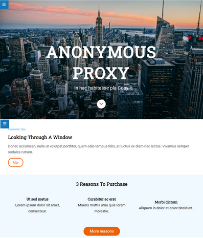

# Anonymous Proxy - Coworking

**Anonymous Proxy Coworking** es mucho más que un espacio de trabajo. Es un lugar de encuentro con personas que buscan aprender, cambiar, conocerse, vivir nuevas experiencias y continuar buscando libertad en sus vidas. Nos dirigimos a personas que:

- Les gusta explorar el mundo y trabajar desde cualquier lugar.
- Están interesados en el autoconocimiento: aquí, el desarrollo personal es tan crucial como el desarrollo profesional.
- Desean vivir una vida más libre y con una mentalidad abierta.
- Son emprendedores, nómadas digitales, escritores, terapeutas, programadores: profesionales que comparten una mentalidad innovadora.

## ¿Qué Ofrecemos?

- **Espacio de Confianza:** Un entorno donde la confianza y la colaboración son fundamentales para el crecimiento personal y profesional.
- **Comunidad Diversa:** Conoce a personas que te desafíen, inspiren y enriquezcan tu vida con nuevas ideas y perspectivas.
- **Eventos y Talleres:** Organizamos talleres de autoconocimiento, dinámicas de grupo y eventos que fomentan la conexión y la exploración.

**Anonymous Proxy** es más que un simple espacio de trabajo. Nuestros objetivos son:

- Fomentar la conexión entre personas.
- Ofrecer un espacio donde se comparten ideas y se aprende de manera colectiva.
- Ser un punto de encuentro para la creatividad y la innovación.

Descubre un coworking donde el trabajo se encuentra con la comunidad, donde las conexiones son tan importantes como las ideas que creas.

¡Bienvenid@s a un nuevo paradigma de coworking!

## 2. ¡Vamos con la landing page!

A continuación, se presentan capturas de pantalla de la landing page **Anonymous Proxy** en diferentes dispositivos, mostrando su diseño responsive y su adaptación a diversas pantallas.

### Escritorio

### Dispositivo Móvil

---

## 3. Tecnologías Utilizadas

**Anonymous Proxy** ha sido desarrollado con un enfoque profesional y utilizando las siguientes tecnologías y prácticas:

### General

- **Estructura Organizada:**
  - Implementación de una estructura de ficheros y carpetas adecuada para un proyecto web.

- **Uso de Starter Kit:**
  - Implementación del Starter Kit para organizar el código HTML y Sass en distintos ficheros.

- **Control de Versiones:**
  - Uso de control de versiones con ramas para gestionar de manera efectiva el desarrollo del proyecto.

### HTML

- **Código HTML Bien Estructurado:**
  - Implementación de código HTML con sintaxis correcta y una estructura bien organizada.

- **Etiquetas Semánticas:**
  - Utilización de etiquetas HTML semánticas apropiadas para cada elemento de contenido.

### CSS / Sass

- **Código Sass Organizado:**
  - Desarrollo de código Sass con sintaxis correcta y una estructura bien organizada.

- **Características de Sass:**
  - Implementación de características de Sass, como variables, anidación y el uso de parciales.

- **Uso Intensivo de Selectores de Clase:**
  - Aplicación de CSS que utiliza selectores de clase de manera efectiva.

- **Flexbox:**
  - Correcto uso de Flexbox para organizar elementos en cajas flexibles.

- **Media Queries:**
  - Implementación de media queries para garantizar el diseño responsive en distintos tamaños de dispositivo.

- **CSS Grid:**
  - Utilización de CSS Grid para posicionar elementos.

- **Transiciones CSS:**
  - Aplicación de transiciones CSS para agregar dinamismo y mejorar la experiencia de usuario en el proyecto web.

---

Este proyecto se ha creado con un compromiso constante con las mejores prácticas aprendidas de desarrollo web para proporcionar una experiencia excepcional a los usuarios.

